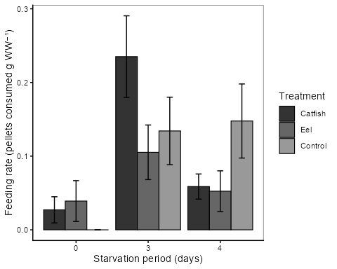

```{=latex}
\clearpage
\providecommand{\chaptermark}[1]{}
\ifcsname c@chapter\endcsname
\setcounter{chapter}{2}
\setcounter{section}{0}
\addcontentsline{toc}{chapter}{\protect\numberline{2}Native vs.\ Novel Threats}
\chaptermark{Native vs.\ Novel Threats}
\fi
\providecommand{\thechapter}{2}
\thispagestyle{empty}
\begin{tikzpicture}[remember picture, overlay]
  \begin{scope}
    \clip ([yshift=-7cm]current page.north west)
          rectangle ([yshift=4.5cm]current page.south east);
    \node[inner sep=0pt, anchor=north]
      at ([yshift=-7cm]current page.north)
      {\includegraphics[height=18.2cm]{images/ch2_cover.jpg}};
  \end{scope}
  \fill[black]
    (current page.north west) rectangle ([yshift=-7cm]current page.north east);
  \node[color=thesissand, align=left,
        font=\fontsize{13}{16}\selectfont\sffamily, anchor=west]
    at ([xshift=1.5cm, yshift=-1.5cm]current page.north west)
    {Chapter \thechapter};
  \node[color=white, text width=0.85\paperwidth, align=left,
        font=\fontsize{22}{28}\selectfont\bfseries\sffamily, anchor=west]
    at ([xshift=1.5cm, yshift=-4cm]current page.north west)
    {Native vs.\ Novel Threats};
  \node[color=white, text width=0.85\paperwidth, align=left,
        font=\fontsize{10}{13}\selectfont\itshape\sffamily, anchor=north west]
    at ([xshift=1.5cm, yshift=-5.0cm]current page.north west)
    {Fear of the new: a predatory invader provokes stronger non-consumptive effects on a keystone native prey than a native predator};
  \fill[black]
    (current page.south west) rectangle ([yshift=4.5cm]current page.south east);
  \node[color=white, text width=0.85\paperwidth, align=left,
        font=\fontsize{9}{13}\selectfont\sffamily, anchor=west]
    at ([xshift=1.5cm, yshift=3.2cm]current page.south west)
    {Olivier V.\ Raven, Calum MacNeil, Finnbar Lee, Robin Holmes, Ian A. K.\ Kusabs, Francis J.\ Burdon \& Deniz Özkundakci};
  \node[color=thesissand, text width=0.85\paperwidth, align=left,
        font=\fontsize{9}{13}\selectfont\itshape\sffamily, anchor=west]
    at ([xshift=1.5cm, yshift=1.5cm]current page.south west)
    {Biological Invasions --- Under review};
\end{tikzpicture}
\null
\clearpage
```

::: {.content-visible when-format="docx"}
Chapter 2 Native vs. Novel Threats
Fear of the new: a predatory invader provokes stronger non-consumptive effects on a keystone native prey than a native predator

{fig-align="center" width=15cm}

Olivier V. Raven, Calum MacNeil, Finnbar Lee, Robin Holmes, Ian A. K. Kusabs, Francis J. Burdon & Deniz Özkundakci

*Biological Invasions* — Under review


:::

::: {.content-visible when-format="html"}
# Native vs. Novel Threats {.unnumbered}
:::

```{r}
#| label: start-ch2
#| include: false

chapter_dir <- normalizePath(file.path(dirname(knitr::current_input(dir = TRUE)), "02_koura_fear"))
if (!dir.exists(chapter_dir)) chapter_dir <- normalizePath(dirname(knitr::current_input(dir = TRUE)))
fig_labels <- c("fig-emmeans-stratified", "fig-refuge-plot", "fig-feeding-plot")
out_dir <- file.path(chapter_dir, "outputs")
dir.create(out_dir, showWarnings = FALSE, recursive = TRUE)

# Capture parent knitr env before any nested knitr calls
parent_knit_env <- knitr::knit_global()

qmd_lines <- readLines(file.path(chapter_dir, "analysis.qmd"), warn = FALSE)
in_r_chunk <- FALSE
r_lines <- character(0)
for (ln in qmd_lines) {
  if (grepl("^```\\{[rR]", ln)) { in_r_chunk <- TRUE; next }
  if (grepl("^```", ln) && in_r_chunk) { in_r_chunk <- FALSE; next }
  if (in_r_chunk) r_lines <- c(r_lines, ln)
}
r_lines <- c(
  paste0(".chwd <- setwd(", deparse(chapter_dir), ")"),
  r_lines,
  "setwd(.chwd)", "rm(.chwd)"
)
tmp_r <- file.path(chapter_dir, ".analysis_tmp.R")
writeLines(r_lines, tmp_r)
eval(parse(file = tmp_r, encoding = "UTF-8"))
unlink(tmp_r)
out_dir <- file.path(chapter_dir, "outputs")

if (!all(file.exists(file.path(out_dir, paste0(fig_labels, ".png"))))) {
  .old_wd <- setwd(chapter_dir)
  knitr::knit(file.path(chapter_dir, "analysis.qmd"), output = tempfile(), quiet = TRUE, envir = parent_knit_env)
  setwd(.old_wd)
  for (lbl in fig_labels) {
    src <- knitr::fig_chunk(lbl, "png")
    if (file.exists(src)) file.copy(src, file.path(out_dir, paste0(lbl, ".png")), overwrite = TRUE)
  }
}
input_dir <- normalizePath(dirname(knitr::current_input(dir = TRUE)))
if (input_dir != chapter_dir) {
  thesis_out <- file.path(input_dir, "outputs")
  dir.create(thesis_out, showWarnings = FALSE, recursive = TRUE)
  file.copy(list.files(out_dir, full.names = TRUE, pattern = "\\.(png|jpg)$"), thesis_out, overwrite = TRUE)
}
knitr::opts_knit$set(root.dir = chapter_dir)
```

## Abstract {.unnumbered}
The non-consumptive effects (NCEs) of predators on prey result in costly antipredator behaviours, including increased refuge use and reduced foraging. NCEs significantly influence prey population dynamics, community interactions, and affect ecosystem functioning, particularly when the prey are keystone species. In Aotearoa-New Zealand, the native freshwater crayfish kōura (*Paranephrops planifrons*) is a keystone species with an important functional role affecting sediment bioturbation, nutrient cycling, and benthic community structure. Kōura are preyed upon by multiple predators including native longfin eel (*Anguilla dieffenbachii*) and invasive brown bullhead catfish (*Ameiurus nebulosus*). Under laboratory conditions, we tested whether visual and chemical cues from these two predators induced different refuge-seeking and feeding behaviour responses by kōura. Predator presence produced in the dark a NCE on refuge use, with kōura exposed to catfish showing significantly greater refuge-seeking behaviour than those exposed to eels. This result is consistent with the generalisation theory triggered by unfamiliar predator cues rather than classic prey naivety. Our study indicates catfish incursions may provoke a greater NCE on kōura behaviours than resident eels. As catfish range expansion continues, these NCEs may represent an ecologically significant and underappreciated threat to kōura populations, compounding the direct predation pressure already documented for this invader.

## Introduction
Biological invasions can have profound impacts on invaded ecosystems, particularly through the introduction of novel predators that prey upon naïve native species lacking coevolved defence mechanisms [@Doherty2016]. Native prey may be naïve not just to a specific invader, but to entire functional groups of predators, making them especially vulnerable to direct predation when an invasion introduces a predator type entirely absent from their evolutionary history [@Sih2010; @Carthey2014]. In addition to these consumptive effects, native prey may exhibit heightened fear responses to invasive predators, leading to the development of anti-predator behaviours such as increased refuge use and avoidance of open habitats [@Kindlinger2017]. These behavioural changes, termed non-consumptive effects (NCEs), can substantially influence population dynamics by reducing foraging activity, growth, and reproductive output [@Preisser2005]. In contrast, native predators generally elicit different responses because prey and predators have coevolved, resulting in behavioural and physiological adaptations that stabilise predator–prey interactions [@Abrams2000].

Chemical signals (kairomones) are a key component of NCEs [@Kasumyan2022]. Freshwater crayfish release and detect kairomones to help navigate aquatic environments and mediate interactions with predatory fish [@Blake1993; @Bronmark2012; @Wood2020b]. Kairomones carry signals via excreta, mucus, or skin, that crayfish use to detect predators [@Appelberg1993]. Crayfish respond more strongly to signals from predators that have consumed conspecifics and to alarm cues released when conspecifics are injured or killed [@Gherardi2011; @Beattie2018]. The NCEs due to kairomone detection include reduced growth, reduced activity levels [@Adams2007; @RambergPihl2020], and altered social dynamics like the use of refuge spaces [@Driscoll2020]. Non-predatory fish can also trigger behaviour changes, likely through an increased awareness of potential risk [@Nystrom2005]. However, the strength of these responses depends on prior experience as wild-caught individual crayfish show stronger antipredator responses than farmed conspecifics naïve to predators [@Martin2014], indicating that both learned behavior and evolutionary history shape kairomone detection.

In Aotearoa-New Zealand (hereafter Aotearoa), the endemic northern freshwater crayfish *Paranephrops planifrons* (White, 1842) is a keystone species impacted by non-native species. This crayfish species is commonly known as kōura and is a taonga (culturally treasured) species for Māori, the indigenous people of Aotearoa, with strong cultural values as a food resource [@Kusabs2009]. Ecologically, kōura play a critical role as ecosystem engineers through their effects on sediment dynamics, nutrient cycling, and benthic community structure [@Collier1997; @Parkyn2001; @Usio2004]. Currently, kōura are threatened by multiple stressors, including climate change, water-quality degradation and invasive species, contributing to widespread population declines [@Lee2025; @Kusabs2026].

Kōura have a long coevolutionary history with the native longfin eel (*Anguilla dieffenbachii*) (hereafter eel) and shortfin eel (*A. australis*) in Aotearoa [@Brown2009; @MacNeil2025]. Reflecting this coevolutionary history, kōura can respond more strongly to eel kairomones than to those of introduced non-native brown trout (*Salmo trutta*), even when sourced from streams where both predators were present [@Shave1994]. @Shave1994 suggest that kōura predator recognition is a fixed behavioural trait shaped by coevolution. An invasive fish species that threatens kōura is the brown bullhead catfish (*Ameiurus nebulosus*) (hereafter catfish). Catfish were introduced to Aotearoa in 1877, and the invasive species has since spread to multiple lakes and rivers in the North Island [@McDowall1990; @Barnes2003; @Dedual2019]. For example, in 2016/18, the presence of catfish was confirmed in two large volcanic lakes, Lakes Rotoiti and Rotorua in the Bay of Plenty region, which have historically contained large populations of kōura [@Francis2019; @Lee2025]. Catfish are highly tolerant of a wide range of environmental conditions [@Scott1973; @Lee2025] and their broad gape and opportunistic feeding behaviour enable the consumption of a wide variety of aquatic prey [@Scott1973; @Dedual2019]. Given Aotearoa lacks native Siluriformes, the recent and ongoing spread of catfish into North Island waterways represents a truly novel predation threat to which kōura may lack adequate behavioural or sensory adaptations to respond.

In this study, we used controlled laboratory experiments to test whether the presence of a novel and native predator induced differences in kōura NCEs, specifically refuge-seeking and feeding behaviours. Our experiments tested the following two hypotheses regarding kōura behavioural responses to predator cues: 1) Kōura would show less shelter-seeking behaviour when presented with catfish compared to eels, due to naivety towards a novel predator [@Carthey2014]; or 2) kōura would respond more strongly to unfamiliar catfish cues than to the native eel, consistent with a generalised fear response to a novel predator type [@Sih2023]. Further, we expected that light regime would have an influence on shelter seeking behaviour, as kōura, like many crayfish, are primarily nocturnal [@Devcich1979; @Johnson2014]. We also predicted that kōura feeding rates would follow the patterns hypothesized above and either be more in the presence of catfish than eels, reflecting stronger antipredator responses to the native predator, or reduced in the presence of the unfamiliar invasive predator, reflecting a generalised fear response to the novel predator. Overall, the refuge-use and feeding experiment aimed to improve understanding of the behavioural mechanisms underlying kōura vulnerability to invasive catfish, and how these responses may differ, and add to, those displayed in the presence of native predators such as eels.

## Materials and Methods
### Animal collection and preparation
In mid-August 2025, 92 kōura were sourced from two catfish-free lakes, Ōkāreka and Tikitapu, within the Rotorua Te Arawa Lakes area in the North Island of Aotearoa. Eels are rare or absent in these lakes [@Martin2007], potentially limiting the recent coevolutionary history with local kōura populations. However, eels are a native predator that has a long record of coexistence with kōura in Aotearoa [@McDowall1990; @Feldmann1994; @Kaulfuss2018]. In this study our focus was on the macroevolutionary implications of the native predator compared to a novel invader, regardless of the local coevolutionary history. In late September 2025, catfish and eels were sourced from Lake Rotoroa in Hamilton in the Waikato region of the North Island. Experiments were conducted at the Aquatic Research Centre of the University of Waikato. All three species were held separately in holding tanks and acclimated for a week in the laboratory conditions. These included a 10:14 light:dark cycle reflecting the seasonal day-length and dechlorinated tap water with stable temperatures (15.6 °C), pH (8.4) and dissolved oxygen concentrations (10 mg l$^{-1}$). These parameters reflect typical physiochemical conditions in the source lakes. Kōura and fish were fed every other day with commercial carnivore pellets (Hikari Tropical, Kyorin Food Industries Ltd., Japan; animal protein 47 %). Because kōura are a taonga (treasured) species, permission was obtained from Te Arawa Lakes Trust and Te Komiti Whakahaere. All experimental procedures were conducted under University of Waikato animal ethics committee approval (protocol number: 1232; see Ethical Approval section).

### Refuge experiment
Prior to the experiments all animals were individually weighed and measured. Only male kōura were used as male crustaceans are usually the most bold and aggressive [@Stein1976; @Figler2005] and restricting test animals to a single sex allowed a smaller overall number of kōura to be used. Kōura had a mean (± SD) orbital carapace length (OCL) of 26.0 mm (± 3.08) (18.35-32.95 mm range) and a mean (± SD) wet weight of 11.7 g (± 4.25) (3–23 g range). Catfish ranged in length from 260-267 mm and 2.34–3.16 kg wet weight and eels ranged in wet weight from 2.50-3.52 kg, with both these size ranges being able to consume adult kōura [@Hicks1997; @Barnes2003; @Ryan2009].

Experiments were conducted in 38 L glass tanks (600 × 200 × 220 mm) with each tank having three sides (apart from front of tank) blacked out to block visual cues from neighbouring tanks. Each tank was divided into two compartments by a 0.5 mm steel mesh divider, allowing visual and chemical cues between compartments, while preventing any physical contact between fish and kōura on either side of the barrier (@fig-aquarium-setup). All tanks were filled with ~26 L dechlorinated tap water and had identical environmental regimes as previously detailed for acclimatisation tanks, with water flow provided by an air stone. Each tank housed a single kōura on one side of the barrier and either a single predator (catfish or eel) or no predator (control) on the other side. A halved terracotta pot (90 mm diameter × 90 mm depth) was positioned on the kōura side of the tank to serve as a potential refuge. To control for potential tank location or compartment side effects, the position of predator treatments within the aquaria was systematically rotated between experimental rounds. The experiment was conducted across eight rounds (each lasting 5 hours), four rounds under light conditions (~400 lux, n = 32 kōura: 11 catfish, 11 eel, 10 control) and four separate rounds with different kōura under dark conditions (~70 lux, n = 32 kōura: 11 catfish, 11 eel, 10 control). Observations were made in the dark using red lighting positioned centrally above the tanks to minimize disturbance, as many aquatic species have limited sensitivity to red wavelengths and are unlikely to perceive this part of the spectrum. Following each individual experimental run, each tank was thoroughly cleaned and refilled with dechlorinated tap water before reuse. Each individual kōura was only exposed once to a fish predator and there were no mortalities of kōura or fish during experiments. All experiments were conducted within a three-week period during October 2025.

At the beginning of each experiment, an individual kōura was placed in the middle of the tank compartment containing the refuge. Kōura location was recorded at 21-time intervals over a 5-hour period, with observations spaced at progressively longer intervals to capture immediate behavioural responses at key timepoints (predator introduction at 60 min, removal at 240 min). The 0-minute recording was the individual’s initial immediate location after its addition to the tank. Kōura location was recorded as either refuge (the animal was using the refuge, being inside it or immediately behind it and touching it) or non-refuge/ in the open (any other location in the tank where the animal was not in the refuge or touching the refuge). The control tanks had no fish added but at 60 minutes and again at 240 minutes, the water in the ‘predator’ compartment was mechanically disturbed by agitating the water with a small hand net for approximately 30 seconds. This was to simulate the disturbance time associated with adding and removing fish in the other treatments with the same size hand net. At the end of each experiment, the kōura was removed after the final 300-minute observation.

### Feeding experiment
Experiments were conducted in glass tanks (320 × 170 × 170 mm), containing 5 L dechlorinated tap water and a halved terracotta pot (90 mm diameter × 90 mm depth). Catfish and eels had been held at the same density in separate identical holding tanks for a week prior to experiment. Fish exudates were collected by placing four fish (catfish or eel) in a 10 L bucket filled with water from the holding tanks for 15 minutes to concentrate the kairomones in the water. For eel and catfish treatments, 1 L from the buckets was added to each tank already holding 5 L of tap water, and for control an additional 1 L of dechlorinated tap water was added. Next, 10 Hikari Tropical carnivore pellets were added to each tank. Experimental trials showed pellets remain intact in tap water for over 24 hours. In three rounds, a total of 46 male kōura were measured and weighed. Their mean (± SD) OCL was 27.93 mm (± 4.80), with a range of 20.48 to 40.88 mm, and the mean (± SD) wet weight of 15.83 g (± 8.99), ranging from 6.00 to 42.00 g. Each kōura was then placed individually in a tank. To investigate how starvation period influenced feeding motivation, each round kōura were starved for different periods (either 0, 3 or 4 days) prior to the feeding experiment. After 0 days starvation, 14 kōura were exposed to eel water (n = 4), catfish water (n = 6) or control water (n = 4). After 3 days starvation, 16 kōura were exposed to eel water (n = 6), catfish water (n = 5) or control water (n = 5). After 4 days starvation, 16 kōura were exposed to eel water (n = 5), catfish water (n = 5) or control water (n = 6). After 24 hours, when each experiment was terminated, the number of pellets eaten (to the nearest quarter pellet) was counted and the feeding rate (pellets eaten per gram of wet weight (WW) of kōura) calculated.

### Data analysis
To analyse kōura refuge use, beta-binomial generalized linear mixed-effects models (GLMMs) were fitted using the glmmTMB package in R [@Brooks2017; @RCoreTeam2025]. To address potential non-independence of repeated observations within tanks, raw observations were first aggregated into three experimental periods (before, during, and after predator introduction) per individual kōura, with the number of observations in refuge out of total observations per period used as the response variable. Treatment (catfish, eel, control) and period (before, during, after) were included as fixed effects, and tank and experimental round as random intercepts. Because light condition and experimental round were fully confounded by design (rounds 1–4 in light, rounds 5–8 in darkness), separate analyses were conducted for each light condition to allow round as a random intercept and to test whether treatment effects varied under each light condition. A beta-binomial distribution was used to account for overdispersion in the binomial proportion data. Model fit was assessed using DHARMa simulation-based residuals, including tests for overdispersion and zero-inflation [@Hartig2024]. Marginal means and pairwise contrasts between factor levels were obtained using the emmeans package [@Lenth2026], with p-values adjusted for multiple comparisons using Sidak correction. Additionally, a combined GLMM (without round as random effect) was fitted to test the overall effect of light condition across all treatments. Spearman rank correlations with Bonferroni-adjusted p-values were used to investigate potential relationships between kōura body size (OCL) and overall refuge use (all time intervals combined) in the three treatments.

Kōura feeding rate was analysed using a linear mixed model with pellets consumed per gram wet weight as the response variable and starvation period (0, 3, 4) as a fixed effect, with tank identity as a random intercept to account for potential tank-level clustering. Because each starvation period was conducted in a separate experimental round, starvation period and experimental round were fully confounded by design. Consequently, round was excluded as a random effect. However, starvation period was included as a fixed effect to test for differences in feeding across hunger states, acknowledging that observed effects may reflect round-specific variation rather than hunger alone. Model selection using AICc indicated that starvation period alone provided the best fit, with treatment not improving model fit (delta AICc = 14.38). Therefore, treatment effects were excluded from the main model and instead examined separately within each starvation period using stratified linear models to avoid confounding treatment comparisons with the starvation-round confounding. Model assumptions were verified using residual diagnostics (Q-Q plots and residual plots) and testing normality of residuals using the Shapiro-Wilk test. As residuals at day 0 starvation violated normality assumptions (*p* = 0.011), a non-parametric Kruskal-Wallis test was executed. Pairwise comparisons for starvation period were conducted using estimated marginal means with Sidak adjustment for multiple comparisons.

## Results
### Refuge experiment
The proportion of time kōura spent in refuge varied across treatments, experimental periods, and light conditions (@fig-emmeans-stratified). Stratified analyses revealed that treatment effects on refuge use differed between light and dark conditions. Under dark condition, kōura exposed to catfish used refuge significantly more than those exposed to eels (`r get_treat_contrast("Dark", "catfish / eel")`; @tbl-emmeans-stratified), however the control treatment in the dark was not significant with either the catfish or the eel treatment (`r get_period_contrast("Dark", "control / catfish")`, `r get_period_contrast("Dark", "control / eel")`). In contrast, under light conditions, there were no significant differences in refuge use between the three treatments, but refuge use differed significantly between experimental periods, with lower refuge use before predator introduction compared to after predator removal (`r get_period_contrast("Light", "before / after")`). No significant period effects were observed in dark conditions. The combined model showed that light regime had a significant effect on refuge use (`r get_light_effect()`), with kōura using refuge more in light than in dark conditions across all treatments. Overall, under light conditions, the pattern of refuge use in the control treatment was more similar to the catfish treatment, whereas under dark conditions it more resembled the eel treatment (Fig. 3; Table S1). There was also no relationship between kōura OCL and refuge use in any of the three treatments (`r get_ocl_corr("catfish")`, `r get_ocl_corr("eel")` and `r get_ocl_corr("control")` for catfish, eel and control treatments respectively, all NS).

For all treatments individual kōura were highly variable in their movement around tanks and use of refuges, even in the time intervals comprising the first 60 minutes of the experiment, before fish were introduced. The coefficient of variations (CVs) for kōura refuge use in the light and the dark before fish introduction were similarly high, being 60.4 % and 58.2 % (both n = 32) respectively, confirming high baseline variation in kōura refuge use, regardless of treatment type. Despite this inherent variation in individual kōura behaviour, clear patterns in kōura refuge use were evident over the course of the experiment (@fig-refuge-plot). Under light conditions, the control showed the largest overall increase in refuge use (`r get_prop("light","control","before")`% to `r get_prop("light","control","after")`%), driven primarily by a sharp rise in the 'after' period, while the catfish treatment showed a more sustained increase across all periods (`r get_prop("light","catfish","before")`% to `r get_prop("light","catfish","after")`%) and the eel treatment the smallest increase (`r get_prop("light","eel","before")`% to `r get_prop("light","eel","after")`%). Under dark conditions, the pattern shifted, with the catfish treatment showing the greatest increase (`r get_prop("dark","catfish","before")`% to `r get_prop("dark","catfish","after")`%), while the eel treatment showed a modest and non-sustained increase (`r get_prop("dark","eel","before")`% to `r get_prop("dark","eel","during")`% during 'exposure', returning to `r get_prop("dark","eel","after")`% 'after'), and the control remained comparatively low throughout (`r get_prop("dark","control","before")`% to `r get_prop("dark","control","after")`%).

### Feeding experiment
The linear mixed model showed that starvation period had a significant effect on kōura feeding rate (3 days: `r format_pval(p_day_starve3)`; 4 days: `r format_pval(p_day_starve4)`; @fig-feeding-plot; @tbl-feeding-summary). Treatment was not included in the main model following model selection. Stratified analyses revealed no significant treatment effects across starvation periods. Although residuals at day 0 violated normality (Shapiro-Wilk *p* = `r sw_day0_p`), the non-parametric Kruskal-Wallis test confirmed no treatment effect (*p* = `r kw_day0_p`). Starvation days 3 and 4 met normality assumptions and showed no significant treatment effects (*p* = `r p_day3_treat` and `r p_day4_treat` respectively). After 4 days starvation, the mean (±SE) kōura feeding rate (pellets g WW$^{-1}$) for the control was over two and a half times that of the catfish and eel treatments (`r get_feed_mean_se("control")` compared to `r get_feed_mean_se("catfish")` and `r get_feed_mean_se("eel")` respectively).

## Discussion
Prey modify their behaviour in response to predation risk, creating a 'landscape of fear' that affects foraging, movement, and habitat use independently of actual predation events [@Laundre2001]. Our study adds to a growing body of literature (i.e., [@Sniegula2025]) showing invasive predators can generate stronger NCEs on native prey than native predators, with potentially far-reaching consequences on invaded ecosystems. The results in our experiments suggest the introduction of a novel predator may change the prey's fear landscape in ways that a native predator does not. Kōura are a keystone species that act as ecosystem engineers in Aotearoa freshwaters, meaning that predator-induced changed in kōura behaviour may indirectly affect ecosystem-level properties (e.g., resources or other species) through non-consumptive pathways [@Peacor2001]. Such indirect effects represent a form of behavioural trophic cascade [@Schmitz1997], whereby predator presence alone drives ecosystem-level change. Our results also highlight that prey naivety does not necessarily manifest as a failure to respond to novel predators. Instead, naïve prey may exhibit an over-avoiding response consistent with generalisation theory [@Sih2010; @Ehlman2019], which potentially has important implications for predicting the ecological impacts of invasive species.

### Refuge use
Under dark conditions, kōura demonstrated greater refuge-seeking behaviour when exposed to the novel catfish than to native eel. This result is notable because it contradicts the classic prey naivety hypothesis, which predicts that prey underestimate or fail to appropriately respond to novel predators due to a lack of shared evolutionary history [@Carthey2014]. Instead, kōura seemingly exhibited an enhanced defensive response to the novel predator. Such over-responses to unfamiliar predators are less commonly reported but are consistent with fear generalisation theory, whereby experience with native predators primes a generalised heightened vigilance response to any unfamiliar threat [@Ehlman2019; @Sih2023]. For naïve prey, unfamiliar cues could trigger such a response because the consequences of ignoring a potential predation threat could be fatal, even when, in reality, the actual predation risk is absent [@Dawkins1979; @Lima1990]. Such generalised responses are often overcautious and energetically costly because prey may initially treat uncertain threats as highly dangerous until further experience is acquired [@Sih2010]. Unlike classic prey naivety scenarios where the novel predator poses no actual threat, catfish genuinely predate kōura, meaning the heightened refuge response carries a real energetic cost but is not disproportionate to the actual risk of predation. Elevated refuge use is itself a meaningful NCE, reducing foraging time with potential consequences for growth, reproduction, and population persistence [@Preisser2005; @Sheriff2020]. However, this behaviour may simultaneously confer protection against direct predation as experimental evidence shows that shelter significantly reduces catfish predation on crayfish [@Adams2007; @Zhao2024]. This result suggests that enhancing or restoring habitat complexity in catfish-invaded lakes could mitigate both direct predation and fear-driven reductions in foraging, though direct field testing is needed.

Before fish were added to the tanks, refuge use by koūra was similar across treatments but highly variable at the individual level, reflecting substantial behavioural variation. The control treatment showed increasing refuge use over time, particularly under light conditions, which is unsurprising given that kōura are nocturnally adapted and need to remain hidden during daylight to avoid visual predators such as cormorants [@Devcich1979]. Importantly, treatment effects on refuge use depended on light condition. Under dark conditions, when kōura are naturally more active, catfish exposure resulted in significantly greater refuge use than eel exposure. Control refuge use was intermediate between the two predator treatments, though the reasons for this pattern are unclear from the current data. The contrasting responses of kōura to catfish and eels indicates biologically meaningful differences in NCE between exposure to a novel and native predator.

Unlike the response when exposed to catfish, kōura reduced their refuge use in the presence of eels. This contrasting response likely reflects the long evolutionary relationship between kōura and eels, though the strength of coevolutionary adaptation in these specific lakes remains uncertain. The lakes naturally have restricted access to the coast limiting the number of eels present and historical vulcanism has affected these dynamics with a potential historical separation approximately 700 years ago following the Kaharoa eruption (~AD 1314; [@Hogg2003]). Nevertheless, kōura probably were able to recognise chemical and visual cues from the eels and respond in a proportionate rather than precautionary way [@Shave1994]. Instead of hiding, kōura may rely on contextual information, such as predator size, movement patterns, or chemical concentrations, to modulate their response [@Wood2020a]. This calibrated response makes ecological sense as longfin eels are the most widely distributed fish in the freshwaters of Aotearoa [@McDowall1990], and a persistent high-intensity refuge response to eels would likely impose substantial foraging costs. Whether shaped by deep coevolutionary history or by recognition of eels as an established native predator, kōura show a nuanced, context-dependent response to eels rather than an over-generalised avoidance strategy. This pattern was most pronounced in the dark conditions, where kōura refuge use in all three treatments began similarly but changed progressively over the course of the experiment. Kōura in the catfish treatment steadily increased their refuge use, while kōura in the eel treatment showed similar behaviour to those in the control treatment, with decreases to baseline levels by the end of the observation period. This result suggests that under conditions most relevant to natural activity by kōura, chemical recognition of the familiar eel predator is sufficient to enable a calibrated, low-cost response, while the unfamiliar catfish continues to elicit sustained precautionary refuge use [@Shave1994; @Wood2020b]. Beyond predator recognition, the reduced refuge use observed in eel-exposed kōura may not reflect a lack of response but could instead represent active escape-searching behaviour (i.e. a "flight" response). If this was the behavioural motivation, kōura would be attempting to move away from an area where they perceived themselves as vulnerable in the confined tank space, rather than retreating to a refuge where they might be prone to a known predator.

### Feeding behaviour
NCEs are not a single process but emerge from the interaction between sensory ecology and environmental context. The absence of a kairomone effect on feeding in this study likely reflects a combination of methodological constraints rather than an absence of NCEs on foraging behaviour. The feeding experiment, in which predators were presented solely through chemical cues without visual information, did not demonstrate a clear fish predator NCE on kōura. This may have been due to the concentration of predator kairomones not being high enough to exceed detection thresholds [@Brown2004], the starvation conditions during the experiment, the restricted time frame of the experiment, or a combination of these factors. Kōura can readily detect necrotic fish tissue and readily leave refuges to scavenge on catfish, eel, and marine fish carcasses with little discrimination between fish species, indicating that chemosensory responses in kōura may depend on cue type, context, and concentration rather than predator identity alone [@MacNeil2025]. The concentration of live fish exudates in our experiment relative to natural conditions is difficult to determine, while kairomones were concentrated by confining fish in a bucket, in our experimental tanks they were subsequently diluted in 5 L of water, not replenished, and potentially degraded over the 24-hour period. Whether the resulting concentration reflects, exceeds or falls below ecologically relevant levels in lakes where kōura and predators coexist remains unclear, and future studies should attempt to quantify natural kairomone concentrations to better calibrate experimental designs [@Achtymichuk2025]. In addition, many crayfishes show a stronger response to alarm cues of conspecifics [@Stebbing2010; @Gherardi2011; @RambergPihl2020], and to kairomones from predators on a conspecifics diet [@Beattie2018]. Fish predators in our experiments were maintained on the same diet as kōura for an extended acclimation period prior to exposure (see Methods), which may have further dampened or negated the threat signals received from kairomones [@Smee2006]. Furthermore, the pre-experiment starvation period for kōura may have been insufficient to elicit a very strong feeding response, as crayfish such as kōura are opportunistic foragers which are necessarily adapted to going for prolonged periods without feeding [@Hazlett2003]. The length of time since feeding can influence foraging behaviour, with previous studies indicating that crayfish will be more active foragers after being starved for at least three days [@Hazlett2003]. In the current study, the longest starvation period was four days and at this point there was a clear discrepancy between the control feeding rate and the much lower feeding rates in the two fish treatments. Allowing for ethics and welfare concerns, if we had extended the starvation period, this may have elicited a stronger and prolonged response. Additionally, the stress of confinement in an artificial setting may itself have altered normal kōura feeding responses, as elevated baseline stress hormones are known to modify foraging behaviour independently of predator cue exposure [@Clinchy2013]. Finally, feeding was measured as a single endpoint after 24 hours, providing no information on whether kōura initially suppressed feeding after kairomone exposure before eventually resuming normal feeding activity [@Wright2010]. Further experiments using higher kairomone concentrations, longer starvation periods, and continuous feeding monitoring would help clarify whether non-visual predator cues generate NCEs on kōura foraging behaviour.

### Conclusions
As ecosystems become increasingly novel under global change, the reliability of historical predator–prey cues may decline, amplifying behavioural mismatches [@Sih2011]. The present study provides experimental evidence that invasive brown bullhead catfish have the potential to exert stronger NCEs on kōura, an endemic freshwater crayfish when compared to their native predator, the longfin eel. The heightened refuge-seeking response to catfish likely reflects a generalised antipredator response triggered by unfamiliar chemical and visual cues, consistent with a fear generalisation framework. In contrast, the reduced response to eels suggests that familiarity with native predators enables kōura to make more proportionate risk assessments, although their behaviour may have also been an antipredator strategy. Future studies should particularly include kōura from eel-inhabited waterways, which would determine whether populations with a recent coevolutionary history with native eels display similar proportionate responses, thereby confirming whether the patterns observed here reflect broader adaptive differences across kōura populations with distinct predatory histories. Additionally, comparative studies of kōura sourced from catfish-invaded versus catfish-free catchments would be worthwhile to assess whether repeated exposure over multiple generations has resulted in rapid evolution or behavioural plasticity in antipredator responses, and whether catfish-experienced kōura show more calibrated responses to catfish presence than naïve kōura. Such evolutionary dynamics could have important implications for predicting kōura persistence in catfish-invaded systems [@Sih2010]. From a management perspective, translocation of kōura from catfish-experienced source populations into catchments facing imminent catfish invasion may represent a more feasible strategy for seeding populations with individuals capable of more adaptive responses. Although we found no significant NCE of fish exudates on feeding behaviour, our study suggests further investigations of non-visual predator cues on kōura foraging behaviour is warranted. Because kōura are a keystone species that ecosystem engineer, even a small increase in refuge use driven by catfish presence could have cascading effects on sediment dynamics, decomposition, and nutrient cycling in invaded lakes. As brown bullhead catfish continue to spread across Aotearoa's rivers and lakes, management strategies aimed at protecting kōura should account for the behavioural cost of catfish NCEs alongside direct predation pressure as an underappreciated and ecologically significant dimension to this invasion.

## Acknowledgements
We thank Te Arawa Lakes Trust and Te Komiti Whakahaere for the opportunity to collect and study the treasured kōura. We are grateful to Soweeta Fort-D’ath and William Anaru (Te Arawa Lakes Trust), and Tihini Grant (Ngāti Pikiao). We also thank Nick Ling and Ben Roche (University of Waikato) for assisting with catfish and eel collection. 

::: {.chapter-only}
### Funding statement
This research was supported by the Fish Futures programme funded through a Ministry of Business, Innovation and Employment grant (CAWX2101) with additional funding provided by the Bay of Plenty Regional Council under the Toihuarewa Waimāori - Bay of Plenty Regional Council Chair in Lake and Freshwater Science programme.

### Authors’ contributions
Study conception and design were undertaken by O.V.R., C.M., and R.H. Experiments were executed by O.V.R. and C.M. Data analysis was performed by O.V.R. and F.L. I.A.K.K. initiated the concept of this study for inclusion in the FishFutures programme, obtained iwi consent, and provided local ecological knowledge and kōura specimens. Manuscript drafting was led by O.V.R. All authors contributed to manuscript revision, approved the results, and agreed on the final manuscript.

### Ethical approval
This study received ethical approval by University of Waikato animal ethics committee, protocol number: 1232. Additional permission to conduct experiments with kōura was granted by Te Arawa Lakes Trust and Te Komiti Whakahaere.

### Declarations
The corresponding author has declared that none of the authors has any competing interests.

### Data availability statement
The code and derived data supporting the findings of this study are openly available on GitHub (https://github.com/OlivierRaven/Koura_Fear)and a rendered version of the analysis is hosted at https://olivierraven.github.io/Koura_Fear/. The primary raw dataset is archived on Zenodo (https://doi.org/10.5281/zenodo.19716761). Peer review documents, including the cover letter and reviewer responses, are available in the manuscript repository in the interest of open and transparent science.
:::

## Tables
```{r}
#| label: tbl-emmeans-stratified
#| echo: false
#| tbl-cap: "Pairwise contrasts for kōura refuge use in light and dark conditions. Results are shown separately for each light condition from beta-binomial GLMMs. Odds ratios and p-values are shown for treatment and period comparisons. P-values are Sidak-adjusted for multiple comparisons within each factor."
knitr::kable(
  read.csv(file.path(out_dir, "tbl-emmeans-stratified.csv")),
  col.names = c("Condition", "Contrast", "Odds ratio", "SE", "df", "Null", "z value", "p value"),
  digits = 3
)
```

## Figures
![(a) Aquarium layout for kōura refuge seeking behaviour experiment. Each experimental round consisted of eight aquaria run simultaneously. Each tank contained a single kōura (K) and refuge (half terracotta plant pot) on one side of a mesh divider. On the other side was either a single catfish (C), eel (E) or a control with no fish. The mesh divider allowed visual and chemical cues while preventing direct physical contact between tank occupants. (b) Experiments were repeated in light and dark (red light), with photographs showing a catfish in the light regime (left) and and an eel in the dark regime (red light) (right) separated from kōura by mesh dividers.](images/setup_combined.png){#fig-aquarium-setup}

![Predicted marginal probabilities of refuge use by treatment and experimental period in light and dark conditions. Results are shown separately for light (top) and dark (bottom) conditions, each fitted with a beta-binomial GLMM. Points represent model-estimated marginal means with 95% confidence intervals shown as error bars. Different letters (a, b) indicate statistically significant differences based on Tukey-adjusted pairwise comparisons within each factor. The dashed line at 0.5 marks the threshold where kōura spend half their time in refuge.](outputs/fig-emmeans-stratified.png){#fig-emmeans-stratified width=6.5in}

{#fig-refuge-plot width=6.5in}

{#fig-feeding-plot width=5in}

::: {.supplementary}
## Supplementary information

*Supplementary tables are provided in the appendices.*
:::
